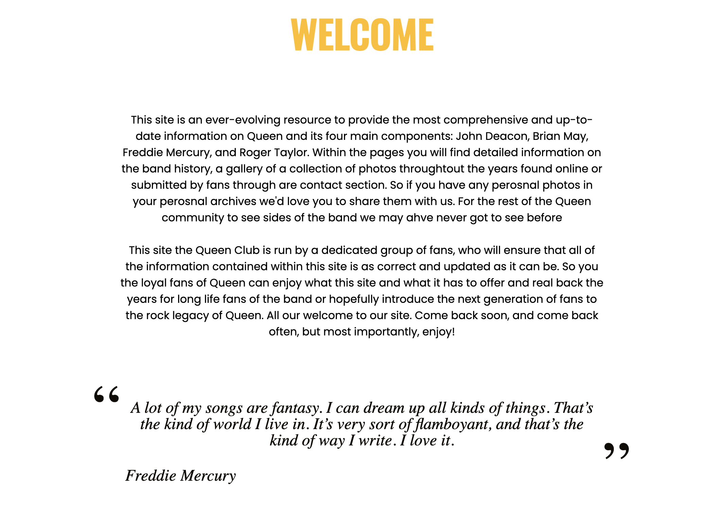
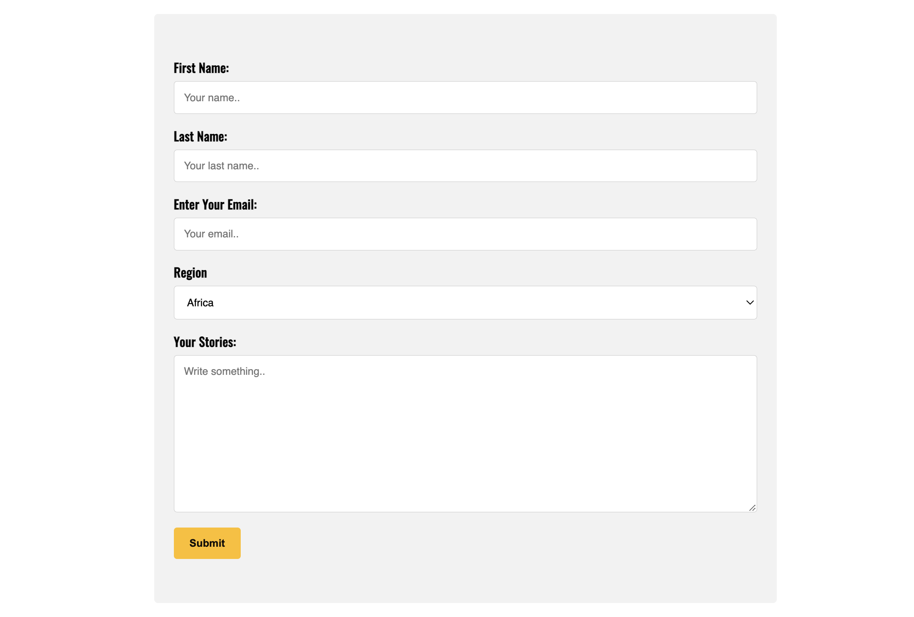
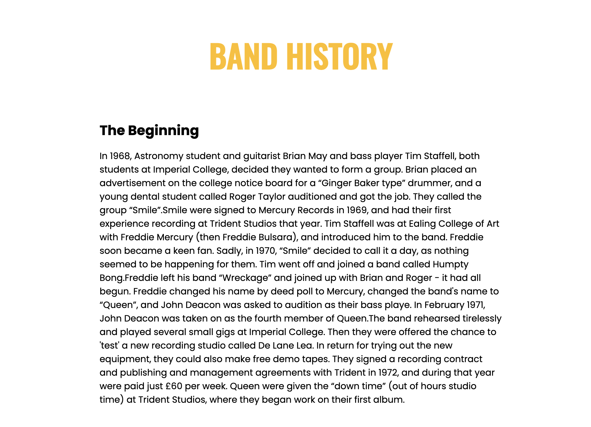

# Queen Club

Queen Club is a website that has been created for the fans of the the iconic rock band Queen. The site main function to be used to educate anyone who visits the site. The site is targeted towards fans of Queen looking to refresh memories or learn some new information about the iconic rock band. 

![Responsice Mockup] 

### User Goals

- Visually appealing.
- Easy to navigate between pages.
- To present quality content about the rock band Queen.

### User Stories

- As a user I, want to get insightful information about the rock band Queen.
- As a user I, want to be able to seamlessly navigate between pages. 
- As a user I, want to be able to view the webiste on any device and have user friendly navigation.

### Site Owner Goals 

- Promote the career/legacy of Queen.
- Hopefully introduce new fans to the band fandom. 

## Features 

### Existing Features

- __Landing page__

  - A fully responsive navigation bar that includes links to the Home page, History Page, Gallery and Contact page and is identical in each of the pages to allow for easy navigation.
  - The landing page also includes a hero-image. 

- __Welcome section__

  - This section introduces the user to what Queen Club is about.  
  - Theres also a quote section below the site introduction which changes each month using famous quotes from the band members. 

- __The Footer__ 

  - The footer section includes links to the relevant social media sites for Queen. The links will open to a new tab to allow easy navigation for the user. 
  - The footer is valuable to the user as it encourages them to follow along on all social media platforms and stay up to date with the latest news about Queen.

- __Gallery__

  - The gallery will provide the user with images from Queens career.
  - This section is valuable to the user as it gives a visual image of the band.

- __Contact Form__

  - This page will allow the user to submit their perosnal information such as an email to allow Queen Club to get in conatact about any personal photos fans m ight have of Queen, along with a stories text area for fans to write about encouters or experiences they had with the band for when the story section is implemented in then future.

- __Embedded Videos__

  - This feature allows users to watch some of the most famous performces by Queen. 
  - This feature improves user experience. 

- __History Page__

  - This feature is the heart of the site as it gives a full breakdown of the bands career from the beginning to present day.

### Features Left to Implement

- Fan stories under the gallery will be a section implemented in the future. 

## Testing 

I feel that the site has hit the goals required by all parties. The site responds nicely to all different screen sizes, the images look clean and sharp on all device sizes. Easy navigation. All links work on the site also.
 
I encountered one issue worth of notice.

I was having issues with my initial hamburger navigation menu for smaller devices, it was was overflowing onto my mian site because I had it off to the right at -200px at a media query max-width of 850px. So when I would test it out on smaller screen devices it overflowing so I changed this to -100% after a few attempts of fiddling round with the css code and this fixed the issue on all screen sizes, no more overflowing on any of my pages on the site.

Another issue I came across was I had a form action embeded within another form action which wouldn't allow my thank you page to work after submitting a contact form. But this issue was rectified after some research on how to fix this issue.

### Validator Testing 

- HTML
  - No errors on any of my pages html when passing through the official [W3C validator](https://validator.w3.org/#validate_by_input)

- CSS
  - No errors were found when passing through the official [(Jigsaw) validator](https://jigsaw.w3.org/css-validator/#validate_by_input)

- Lighthouse
  - No errors were found when passing through the official [(Lighthouse) validator] 

### Unfixed Bugs

I haven't come acorss any unfixed bugs from my testing so far. 

## Deployment 

- The site was deployed to GitHub pages. The steps to deploy are as follows: 
- In the GitHub repository, navigate to the Settings tab 
- From the source section drop-down menu, select the main branch
- Once the main branch has been selected, the page will be automatically refreshed with a detailed ribbon display to indicate the successful deployment. 

The live link can be found here - 

## Credits 

(In this section you need to reference where you got your content, media and extra help from. It is common practice to use code from other repositories and tutorials, however, it is important to be very specific about these sources to avoid plagiarism.)

### For Code Feature Inspiration 
- https://www.w3schools.com/howto/howto_css_contact_form.asp
- hoiw to create a check box hmaburger menu was taken from https://code-boxx.com/simple-responsive-pure-css-hamburger-menu/ 
- The styling for my navigation menu for small devices was taken from https://www.technologywang.com/2022/06/How-To-Create-Responsive-Navigation-Bar-using-HTML--CSS-5681.html

### For Content and design inspiration
- The icons in the footer were taken from [Font Awesome](https://fontawesome.com/)
- for the font style i used https://fonts.google.com/ 
- https://www.queenpedia.com/index.php?title=Welcome....
- https://en.wikipedia.org/wiki/Queen_(band)