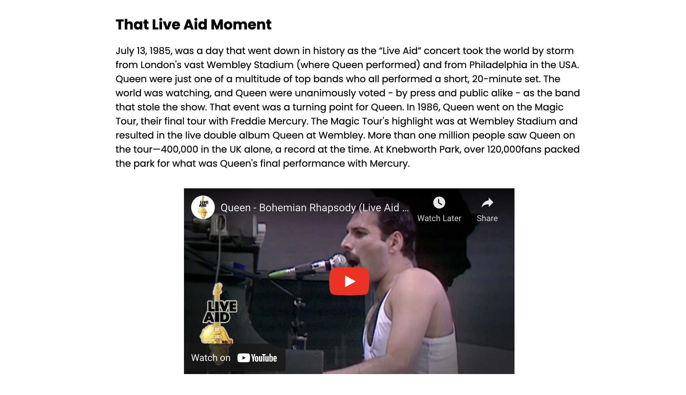

# Queen Club

Queen Club is a website that has been cretasedf as hub for the fans of the the iconic rock band Queen. Its is meant to be used to educate. the site is targeted towards fans of Queen looking to reel back the years or learn some new information on the band. The gallery is where fans can add their perosonal touch to the site sending in photos that will be vetted and added accordingly to the site. 

![Responsice Mockup] 

## Features 

### Existing Features

- __Landing page__

  - A fully responsive navigation bar that includes links to the Home page, History Page, Gallery and Contact page and is identical in each of the pages to allow for easy navigation.
  - The landing page also includes a hero-image. 
  - This page introduces the user to Queen Club. 

- __The Footer__ 

  - The footer section includes links to the relevant social media sites for Queen. The links will open to a new tab to allow easy navigation for the user. 
  - The footer is valuable to the user as it encourages them to follow alomg on all socila platform and stay up to date with the latest news abouyt Queen.

- __Gallery__

  - The gallery will provide the user with supporting images to see what the meet ups look like. 
  - This section is valuable to the user as they will be able to easily identify the types of events the organisation puts together. 

- __Contact Form__

  - This page will allow the user to submit their perosnal information such as an email to allow Queen Club to keep in conatact about any first hand photos of queen, along with a section to write your fan stories

- __Embedded Videos__

  - This feature allows users to watch some of the most famous performces by Queen. 
  - This feature improves user retention on the site. 

### Features Left to Implement

- Fan stories under the gallery on the Gallery Page.  

## Testing 

(insert testing)

### Validator Testing 

- HTML
  - No errors were returned when passing through the official [W3C validator](https://validator.w3.org/nu/?doc=https%3A%2F%2Fcode-institute-org.github.io%2Flove-running-2.0%2Findex.html)
- CSS
  - No errors were found when passing through the official [(Jigsaw) validator](https://jigsaw.w3.org/css-validator/validator?uri=https%3A%2F%2Fvalidator.w3.org%2Fnu%2F%3Fdoc%3Dhttps%253A%252F%252Fcode-institute-org.github.io%252Flove-running-2.0%252Findex.html&profile=css3svg&usermedium=all&warning=1&vextwarning=&lang=en#css)
- Lighthouse
  - 

### Unfixed Bugs

(You will need to mention unfixed bugs and why they were not fixed. This section should include shortcomings of the frameworks or technologies used. Although time can be a big variable to consider, paucity of time and difficulty understanding implementation is not a valid reason to leave bugs unfixed.)

contact form d

## Deployment 

- The site was deployed to GitHub pages. The steps to deploy are as follows: 
  - In the GitHub repository, navigate to the Settings tab 
  - From the source section drop-down menu, select the main branch
  - Once the main branch has been selected, the page will be automatically refreshed with a detailed ribbon display to indicate the successful deployment. 

The live link can be found here - 

## Credits 

(In this section you need to reference where you got your content, media and extra help from. It is common practice to use code from other repositories and tutorials, however, it is important to be very specific about these sources to avoid plagiarism.)

- The text for the Home page was taken from Wikipedia - Queen - section 1: History and Queenpeedia.com - Band History
- The icons in the footer were taken from [Font Awesome](https://fontawesome.com/)
- https://www.w3schools.com/howto/howto_css_contact_form.asp
- https://www.w3schools.com/howto/howto_js_sidenav.asp 
- 
- 
- 
